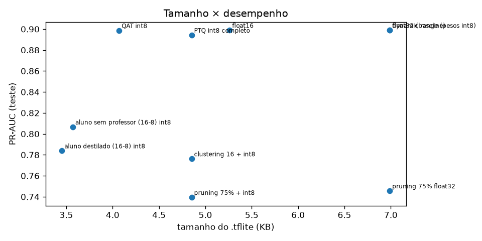
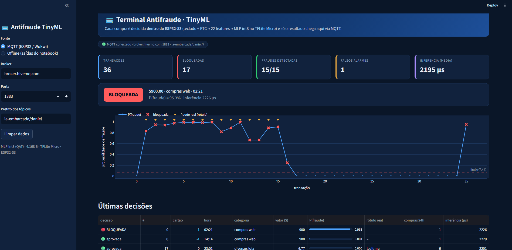
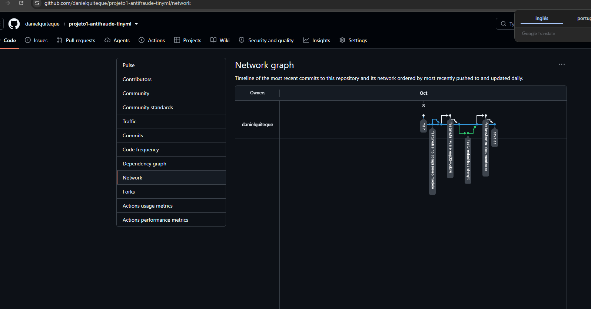
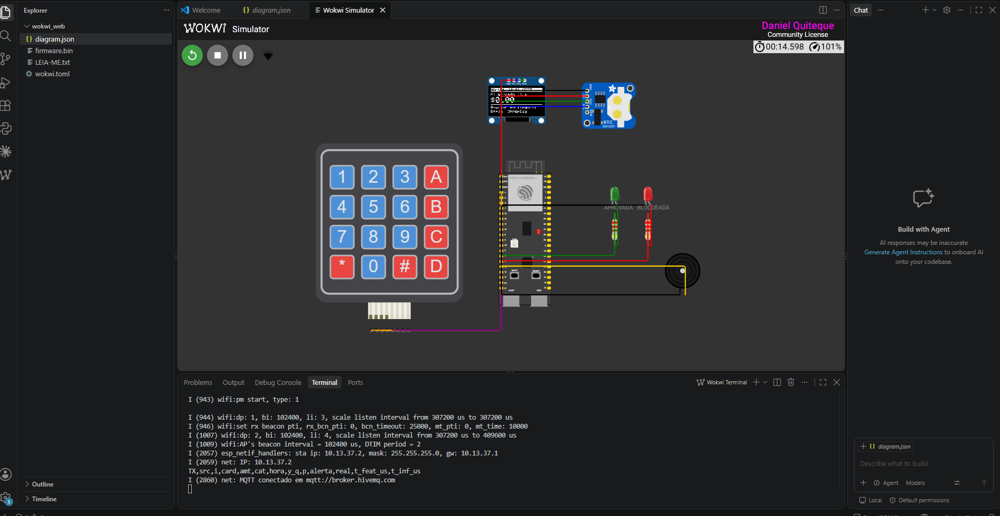
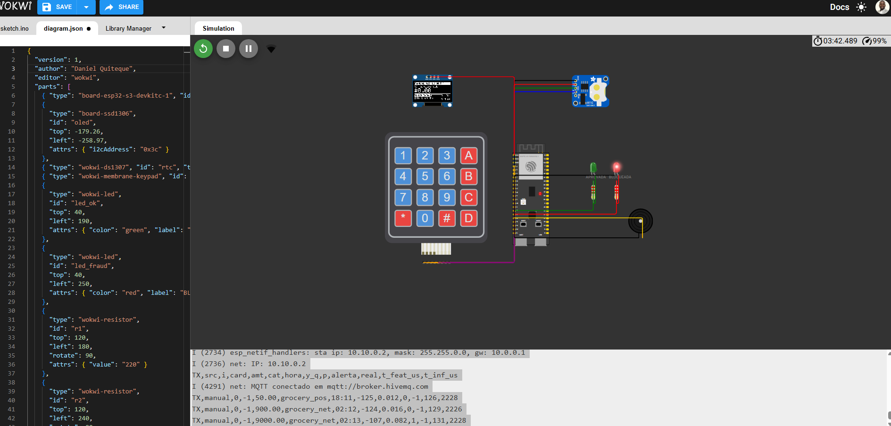
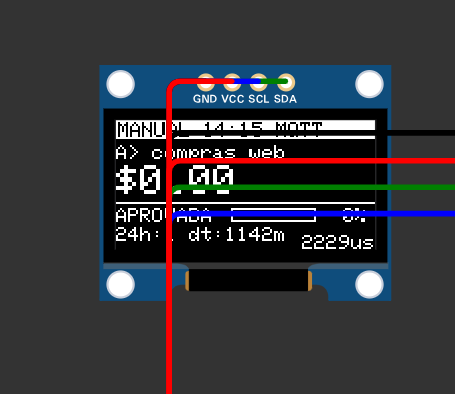
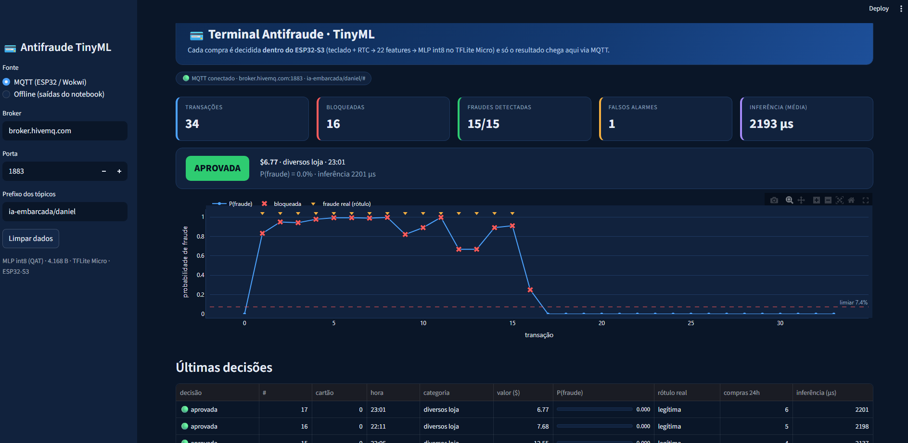
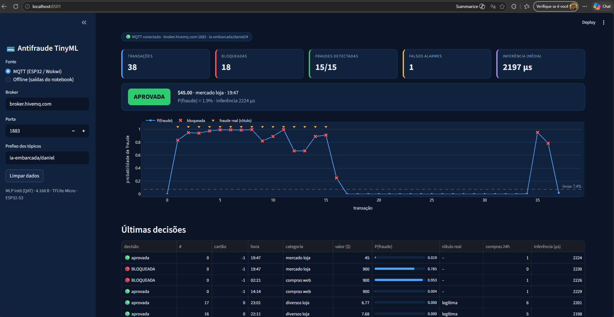
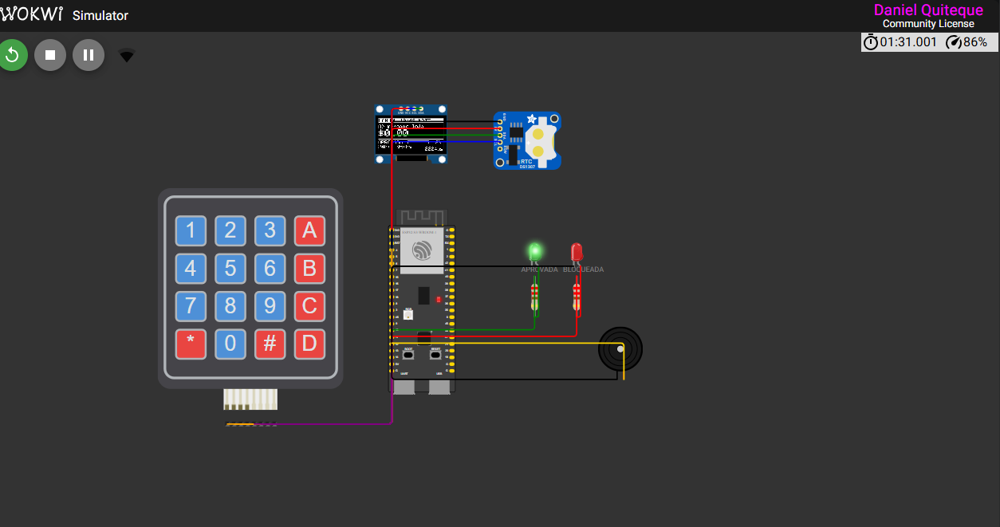

# Relatório Técnico — Terminal de Pagamento com Detecção de Fraude Embarcada (TinyML no ESP32-S3)

**Pós-graduação em Inteligência Artificial Aplicada — UniSENAI**
**Unidade Curricular:** IA Embarcada e Modelos Compactos · **Professor:** MSc. Rodrigo Kobashikawa Rosa
**Autor:** Daniel Quiteque · **Data:** 08/10/2026 · **Versão:** 1.0
**Repositório:** https://github.com/danielquiteque/projeto1-antifraude-tinyml

---

## Sumário
1. Objetivo do projeto
2. Problema e aplicações
3. Dados: características, volume e tratamento
4. Modelo: rede neural, treinamento e escolhas
5. Conversão e compressão
6. Arquitetura da solução
7. Tecnologias utilizadas
8. Componentes de hardware (circuito no Wokwi)
9. Funcionamento da simulação no Wokwi
10. Estrutura do software
11. Backend
12. Interface (dashboard Streamlit)
13. Comunicação entre os componentes
14. Fluxo dos dados
15. Testes realizados
16. Resultados obtidos
17. Problemas encontrados e soluções
18. Evidências dos testes
19. Conclusão
20. Possíveis melhorias futuras

---

## 1. Objetivo do projeto

Desenvolver uma aplicação completa de IA embarcada que cumpra as quatro etapas exigidas pelo projeto final da disciplina:

| Etapa exigida | Como foi atendida |
|---|---|
| Coleta de dados de sensores | Teclado matricial 4×4 (valor e categoria da compra) e relógio de tempo real **DS1307 via I2C** (hora da compra) |
| Treinamento com dataset público | MLP treinado com o *Credit Card Transactions Fraud Detection* (simulador Sparkov, 1,78 milhão de transações) |
| Conversão e compressão | 9 variantes comparadas (float16, *dynamic range*, PTQ int8, **QAT int8**, pruning, clustering, destilação); embarcado o **QAT int8 de 4.168 bytes** |
| Pipeline de inferência no dispositivo | Leitura dos sensores → estado do cartão → 22 features → padronização → quantização int8 → MLP no **TFLite Micro** → LED/buzzer/OLED/MQTT, tudo no **ESP32-S3** |

O objetivo de negócio é **decidir no próprio terminal de pagamento se uma compra é fraudulenta**, sem enviar os dados do cartão para a nuvem.

## 2. Problema e aplicações

### 2.1 Problema
A detecção de fraude em cartões normalmente roda em servidores do banco: o terminal envia a transação, espera a resposta e só então aprova. Isso tem três custos:

- **Privacidade (LGPD):** dados do cartão e do comportamento do cliente trafegam e ficam armazenados em terceiros.
- **Latência e disponibilidade:** sem rede (zona rural, metrô, avião, falha de operadora) não há proteção — ou se recusa a venda, ou se aprova sem análise.
- **Custo:** cada consulta ao servidor custa banda e processamento.

**Pergunta do projeto:** um microcontrolador de baixo custo consegue tomar essa decisão sozinho, em milissegundos, com qualidade próxima à de um modelo em ponto flutuante?

### 2.2 Aplicações
| Aplicação | Por que a decisão local ajuda |
|---|---|
| Maquininhas de cartão (POS) | Primeira barreira antes da autorização; funciona em modo *offline* |
| Catracas e validadores de transporte | Decisão em < 10 ms, muitas vezes sem conectividade |
| *Vending machines*, totens de autoatendimento, postos | Equipamentos baratos e distribuídos, conexão intermitente |
| Pagamentos por *wearables* e IoT | Bateria e privacidade: o dado não sai do dispositivo |
| Regiões com conectividade precária | Aprovação offline com risco controlado, sincronizando depois |

## 3. Dados: características, volume e tratamento

### 3.1 Fonte
Dataset público ***Credit Card Transactions Fraud Detection*** (Kaggle, kartik2112), gerado pelo simulador open-source **Sparkov** (1.000 clientes, jan/2019 a dez/2020). O notebook regenera os dados com o **mesmo simulador e a mesma configuração**, o que torna o projeto 100 % reprodutível sem credenciais (há opção de ler o CSV do Kaggle, com as mesmas colunas). Dados de cartão reais são protegidos; por isso o projeto usa dados **sintéticos realistas**.

### 3.2 Volume e características
| Item | Valor |
|---|---|
| Transações | **1.783.210** |
| Fraudes | **9.427 (0,53 %)** — classe fortemente desbalanceada |
| Cartões (clientes) | 993 |
| Período | 01/2019 – 12/2020 |
| Colunas usadas | número do cartão, *timestamp*, data de nascimento, categoria (14), valor, rótulo `is_fraud` |

**Análise exploratória** (seção 1 do notebook): a fraude acontece **em rajadas**, principalmente **de madrugada (22h–3h)**, e com **valores muito acima do padrão do cliente**. Médias das features por classe:

| Feature | Legítima | Fraude | Leitura |
|---|---:|---:|---|
| `log1p(valor)` | 3,50 (≈ US$ 32) | 5,56 (≈ US$ 259) | fraude tem valor ~8× maior |
| `hour_cos` | 0,00 | **0,73** | fraude concentrada perto da meia-noite |
| `log_dt` (tempo desde a compra anterior) | 9,20 (≈ 2,7 h) | 8,40 (≈ 1,2 h) | compras mais próximas (rajada) |
| `amt_vs_ema` (valor vs. média do cartão) | −0,66 | **+0,36** | acima do padrão do próprio cliente |
| `log_sum24` (gasto nas últimas 24 h) | 4,74 | 6,31 | muito mais dinheiro no dia |

### 3.3 Tratamento e engenharia de features
Princípio adotado: **usar só o que o ESP32 consegue calcular**. O terminal não conhece o histórico do banco — conhece o teclado, o relógio e as compras que ele mesmo viu. Para cada cartão, o firmware mantém em RAM (~400 bytes) o *timestamp* da última compra, uma **média móvel exponencial** (EMA, α = 0,1) dos valores e um ***ring buffer*** com as compras das últimas 24 h.

| # | Feature | Origem no dispositivo |
|---|---|---|
| 0 | `log1p(valor)` | teclado |
| 1–2 | `sin` e `cos` de 2π·hora/24 | RTC DS1307 (I2C) |
| 3 | idade do titular | perfil do cartão |
| 4 | `log1p(segundos desde a compra anterior)` | RTC + estado do cartão |
| 5 | `log1p(valor) − log1p(EMA anterior)` | estado do cartão |
| 6 | `log1p(nº de compras nas últimas 24 h)` | *ring buffer* |
| 7 | `log1p(soma das compras nas últimas 24 h)` | *ring buffer* |
| 8–21 | categoria *one-hot* (14 categorias) | teclado (tecla A) |

| Variável bruta | Tratamento aplicado | Motivo |
|---|---|---|
| Valor | `log(1 + valor)` | comprime a cauda longa (valores de poucos dólares a milhares) |
| Hora | `sin` e `cos` de 2π·hora/24 (hora com minutos em fração) | a hora é circular: 23h fica perto de 1h |
| Data de nascimento | idade em anos na data da compra | perfil do titular |
| *Timestamp* | `log(1 + Δt)` em segundos; **1ª compra do cartão = 7 dias**; mínimo 1 s | detecta compras em rajada |
| Histórico de valores | `log(1+valor) − log(1+EMA anterior)`, EMA com α = 0,1; **1ª compra = 0** | compara com o padrão do próprio cliente |
| Últimas 24 h | `log(1 + nº)` e `log(1 + soma)` na janela [t − 24 h, t), **sem a compra atual** | velocidade de gasto |
| Categoria | *one-hot* com 14 colunas | evita impor uma ordem falsa entre categorias |

- As 8 features contínuas são **padronizadas** (`(x − μ)/σ`) com μ e σ calculados **só no treino** (sem vazamento de informação da validação/teste) e exportados para o header C `fraud_params.h`.
- Não houve remoção de *outliers* nem imputação: os casos de borda (primeira compra, janela vazia) têm valores padrão definidos e idênticos no Python e no C.
- O código C `fraud_features.c` replica exatamente a função Python — verificado pelo teste de paridade (seção 15.4).

### 3.4 Divisão dos dados
**Por cartão:** 70 % dos cartões para treino, 15 % validação, 15 % teste. Todas as transações de um cartão ficam no mesmo conjunto, então **o teste só tem clientes nunca vistos no treino**.

| Conjunto | Amostras | Fraude | Cartões |
|---|---:|---:|---:|
| Treino | 1.268.389 | 0,52 % | 695 |
| Validação | 255.596 | 0,56 % | 149 |
| Teste | 259.225 | 0,56 % | 149 |

> A divisão temporal (treino até mar/2020, teste jul–dez/2020) foi testada e o PR-AUC caiu para ~0,17: o simulador tem *drift* (a mediana do valor legítimo cai de US$ 52 para US$ 33). Isso foi documentado como limitação e motivaria monitoramento e re-treino em produção.

## 4. Modelo: rede neural, treinamento e escolhas

### 4.1 Arquitetura da rede
**MLP (Perceptron Multicamadas) 22 → 32 → 16 → 1**:

| Camada | Neurônios | Ativação | Parâmetros (entradas × neurônios + bias) |
|---|---:|---|---:|
| Entrada | 22 | — | — |
| Dense 1 | 32 | ReLU | 22·32 + 32 = **736** |
| Dense 2 | 16 | ReLU | 32·16 + 16 = **528** |
| Saída | 1 | Sigmoid | 16·1 + 1 = **17** |
| **Total** | | | **1.281** (conta à mão = `model.summary()`) |

Estimativa de memória: float32 ≈ 5,0 KB de pesos; int8 ≈ 1,3 KB + *overhead* do FlatBuffer. O maior tensor de ativação tem 32 valores, então a RAM de ativações é mínima.

**Por que um MLP e não algo maior?** Os dados já chegam como um vetor de 22 features calculadas no dispositivo (não há imagem nem série longa), e o MLP só usa dois operadores (`FULLY_CONNECTED` e `LOGISTIC`), os mais baratos e mais bem suportados no TFLite Micro.

### 4.2 Treinamento
| Hiperparâmetro | Valor |
|---|---|
| Framework | TensorFlow 2.19 / Keras 2 (`tf_keras`) + `tensorflow-model-optimization` 0.8 |
| Perda | entropia cruzada binária |
| Otimizador | Adam, lr = 2·10⁻³ |
| Batch / épocas | 2.048 / até 25, *early stopping* em `val_pr_auc` (paciência 3) |
| Métricas | **PR-AUC** e **recall** |
| Passos por época | 620 (1.268.389 amostras / 2.048) — ~1–3 s por época |
| Desbalanceamento | `class_weight` testado e descartado (PR-AUC pior); tratado na escolha do limiar (seção 4.3) |

**Curva de aprendizado** (PR-AUC por época): o treino sobe de 0,21 para 0,885 e a validação de 0,67 para **0,884** ao longo das 25 épocas, com as duas curvas próximas — **sem sobreajuste**. O *early stopping* (paciência 3) não chegou a interromper: a validação continuou melhorando até a última época.

| Época | 1 | 5 | 10 | 15 | 20 | 25 |
|---|---:|---:|---:|---:|---:|---:|
| PR-AUC treino | 0,212 | 0,793 | 0,841 | 0,865 | 0,878 | 0,885 |
| PR-AUC validação | 0,670 | 0,802 | 0,848 | 0,862 | 0,875 | 0,884 |

Depois do treino base, o modelo passou por **4 épocas de *fine-tuning* com QAT** (lr = 5·10⁻⁴), descrito na seção 5.

**Por que PR-AUC e não acurácia?** Com 0,53 % de fraude, um modelo que sempre diz "legítima" tem 99,5 % de acurácia e não pega nenhuma fraude. PR-AUC e recall medem a classe rara.

### 4.3 Escolha do limiar (*threshold*)
Em fraude, **o falso negativo é o erro caro**. O limiar foi escolhido na **validação** com a regra **recall ≥ 90 % e maior precisão possível**. Como a quantização desloca levemente as probabilidades, o limiar foi **recalibrado com o próprio modelo int8 embarcado**: **0,0742**, que na saída int8 vira **q ≥ −109**. O firmware compara diretamente no domínio int8, sem desquantizar.

### 4.4 Métricas de avaliação
A classe positiva é **fraude**. VP = fraude bloqueada, FN = fraude aprovada (o erro caro), FP = compra legítima bloqueada (falso alarme), VN = legítima aprovada.

| Métrica | Fórmula | O que responde |
|---|---|---|
| Precisão | VP / (VP + FP) | dos bloqueios, quantos eram fraude? |
| **Recall** (sensibilidade) | VP / (VP + FN) | das fraudes, quantas foram pegas? |
| F1 | 2 · precisão · recall / (precisão + recall) | equilíbrio entre os dois |
| **PR-AUC** (*average precision*) | área sob a curva precisão × recall, em todos os limiares | qualidade do ranking na classe rara — **métrica principal** |
| ROC-AUC | área sob a curva TPR × FPR | separação geral; fica otimista com 99,5 % de negativos |

Implementação no notebook: `average_precision_score`, `roc_auc_score`, `precision_score`, `recall_score`, `f1_score` e `confusion_matrix` (scikit-learn), na função `report()`; no treino, `keras.metrics.AUC(curve="PR")` e `keras.metrics.Recall`.

### 4.5 Matrizes de confusão

**Modelo base float32 — conjunto de teste (259.225 transações, 149 cartões inéditos), limiar 0,153:**

| | Previsto: legítima | Previsto: fraude |
|---|---:|---:|
| **Real: legítima** | VN = 256.907 | FP = 862 |
| **Real: fraude** | FN = 152 | VP = 1.304 |

Precisão 0,602 · recall 0,896 · F1 0,720 · PR-AUC 0,899 · ROC-AUC 0,998.

**Modelo embarcado QAT int8 — mesmo conjunto de teste, limiar 0,074 (q ≥ −109):**

| | Previsto: legítima | Previsto: fraude |
|---|---:|---:|
| **Real: legítima** | VN ≈ 257.023 | FP ≈ 746 |
| **Real: fraude** | FN ≈ 157 | VP ≈ 1.299 |

Precisão 0,635 · recall 0,892 · F1 0,742 · PR-AUC 0,899. *Contagens derivadas das métricas registradas pelo notebook (±1); a célula da seção 6 passou a imprimir esta matriz diretamente na próxima execução.* Em relação ao float32, o modelo embarcado gera **116 falsos alarmes a menos** e deixa passar **5 fraudes a mais** — troca favorável para o lojista, com o mesmo PR-AUC.

**No dispositivo — replay de 133 transações de 3 cartões do teste, executado pelo ESP32 no Wokwi:**

| | Previsto: legítima | Previsto: fraude |
|---|---:|---:|
| **Real: legítima** | VN = 87 | FP = 1 |
| **Real: fraude** | FN = 1 | VP = 44 |

Recall 44/45 = 0,978 · precisão 44/45 = 0,978. O único falso alarme é a primeira compra de um cartão (US$ 300,99 · diversos loja · 22:28, sem histórico, P = 25 %); a única fraude perdida é uma compra pequena e em horário comum (US$ 18,14 · entretenimento · 20:36, P = 5,9 %, logo abaixo do limiar de 7,4 %).

### 4.6 Algoritmos de treinamento e de inferência

| Etapa | Algoritmo | Onde |
|---|---|---|
| Aprendizado | Retropropagação com **Adam** (lr 2·10⁻³) minimizando a **entropia cruzada binária** | notebook, seção 3.2 |
| Parada | *Early stopping* em PR-AUC de validação (paciência 3, restaura os melhores pesos) | notebook, seção 3.2 |
| Limiar | Curva precisão × recall na validação → maior precisão com recall ≥ 90 % | `pick_threshold()` |
| Quantização pós-treino (PTQ) | Calibração dos *ranges* com *representative dataset* (2.000 amostras + 500 fraudes), quantização afim int8 | `convert(..., "int8")` |
| **QAT** | *Fake quantization* nos pesos e ativações durante 4 épocas de *fine-tuning* (lr 5·10⁻⁴) | `tfmot.quantization.keras.quantize_model` |
| Pruning | Poda por magnitude com esparsidade polinomial até 75 % | `tfmot.sparsity` |
| Clustering | *k-means* (init k-means++) com 16 centróides por camada | `tfmot.clustering` |
| Destilação | Aluno 16-8 com perda α·BCE(rótulo) + (1−α)·T²·BCE(soft targets), T = 3, α = 0,5 | classe `Distiller` |
| **Inferência no ESP32** | 1) features + padronização em float; 2) quantização `q = round(x/0,04221) − 12`; 3) `FULLY_CONNECTED` int8 com acumulação int32 e requantização (ReLU fundida) ×3; 4) `LOGISTIC` int8; 5) decisão `q_out ≥ −109` | `fraud_features.c`, `fraud_model.cc` (TFLite Micro) |

## 5. Conversão e compressão

Todas as variantes foram avaliadas **no mesmo conjunto de teste e com o mesmo limiar**. A tensor arena foi **medida rodando o runtime TFLite Micro** (o mesmo motor do ESP32), não estimada.

| Modelo | `.tflite` | gzip | Arena TFLM | PR-AUC | Recall | Roda no TFLM? |
|---|---:|---:|---:|---:|---:|:-:|
| float32 (baseline) | 7.156 B | 5.797 B | 1.696 B | 0,899 | 0,90 | sim |
| float16 | 5.388 B | 3.694 B | — | 0,899 | 0,90 | **não** |
| *dynamic range* | 7.156 B | 5.798 B | — | 0,899 | 0,90 | **não** (híbrido) |
| PTQ int8 completo | 4.968 B | 2.845 B | 1.984 B | 0,894 | 0,90 | sim |
| **QAT int8 (embarcado)** | **4.168 B** | 2.398 B | **1.600 B** | **0,899** | 0,85* | sim |
| pruning 75 % + int8 | 4.968 B | 2.133 B | 1.984 B | 0,739 | 0,69 | sim |
| clustering 16 + int8 | 4.968 B | 2.043 B | 1.984 B | 0,776 | 0,73 | sim |
| aluno destilado (16-8) int8 | 3.536 B | 1.810 B | 1.776 B | 0,784 | 0,68 | sim |
| aluno sem professor (controle) | 3.656 B | 1.843 B | 1.776 B | 0,807 | 0,78 | sim |

\* Com o limiar recalibrado para o QAT: precisão 0,635 · **recall 0,892** · F1 0,742.



**Leitura crítica e escolhas:**
- **float16 e *dynamic range*** reduzem o arquivo, mas **o TFLite Micro não os executa**. Em microcontrolador, a quantização tem de ser **int8 completa**.
- **PTQ int8**: arquivo ~70 % do float32, perda de só 0,005 de PR-AUC. Quantização afim: `q = round(x/scale) + zero_point`; o erro de arredondamento é ≤ scale/2. O *representative dataset* incluiu 500 fraudes para calibrar a cauda da distribuição.
- **QAT** (*fake quant* durante 4 épocas de *fine-tuning*): **recupera o PR-AUC do float32** e gera o **menor modelo completo** (4.168 B) → **escolhido para embarcar**.
- **Pruning e clustering** não diminuem o `.tflite` (zeros e centróides continuam armazenados como int8); só ganham no gzip (útil em OTA) e custaram PR-AUC — com 1,3 mil parâmetros não há redundância para cortar.
- **Destilação** (professor 128-64-32 → aluno 16-8): o aluno destilado ficou **abaixo** do aluno treinado só com rótulos. Com 1,2 milhão de exemplos o aluno já aprende bem sozinho. Resultado negativo registrado com honestidade, graças ao grupo de controle.

**Exportação:** `fraude_model.tflite` → array C `model_data.cc` (equivalente a `xxd -i`, com `alignas(16)`), mais `fraud_params.h` (μ, σ, categorias, limiar, parâmetros de quantização, arena) e `replay_data.h` (133 transações brutas do teste para o modo replay).

## 6. Arquitetura da solução

```
 ┌──────────────────────── ESP32-S3 (Wokwi) ────────────────────────┐
 │  SENSORES            PRÉ-PROCESSAMENTO            INFERÊNCIA      │      ┌────────────────┐      ┌───────────────────┐
 │  Teclado 4×4 ──┐     estado do cartão (RAM)       quantiza int8   │ MQTT │ Broker público │ MQTT │ Dashboard         │
 │  (GPIO)        ├──►  Δt · EMA · janela 24 h  ──►  MLP 22-32-16-1 ─┼─────►│ HiveMQ         ├─────►│ Streamlit         │
 │  RTC DS1307 ───┘     22 features padronizadas     TFLite Micro    │ JSON │ :1883          │      │ (gráficos, KPIs)  │
 │  (I2C)                                            ~2,2 ms         │      └────────────────┘      └───────────────────┘
 │                         ATUAÇÃO: OLED (I2C) · LED verde/vermelho · buzzer (PWM) · serial CSV
 └────────────────────────────────────────────────────────────────────┘
          ▲
          │ firmware.bin (ESP-IDF 5.4.2) ← model_data.cc / fraud_params.h ← notebook (treino + compressão)
```

Princípio *edge-first*: **a decisão é 100 % local**. O MQTT carrega só o resultado (telemetria); se a rede cair, o terminal continua decidindo.

### 6.1 Jornada de uso no caixa

| Passo | Quem | O que acontece | Componente |
|---|---|---|---|
| 1 · Digita | Lojista | Informa o valor (0–9) e escolhe a categoria (tecla A) | Teclado 4×4, OLED |
| 2 · Paga | Lojista | Aperta `#`; o terminal lê a hora da compra | RTC DS1307 |
| 3 · Decide | Terminal | Atualiza o estado do cartão, calcula 22 features, quantiza e roda a MLP int8 (~2 ms) | ESP32-S3 + TFLite Micro |
| 4 · Sinaliza | Terminal | LED verde + bipe curto (aprovada) ou LED vermelho + bipe duplo (bloqueada); OLED mostra a decisão e a P(fraude) | LEDs, buzzer, OLED |
| 5 · Monitora | Gestor | Acompanha as decisões, os indicadores e a latência no painel | MQTT → dashboard |

Os passos 1 a 4 não dependem de rede; o passo 5 é o único que precisa de conectividade.

## 7. Tecnologias utilizadas

| Camada | Tecnologia |
|---|---|
| Treino e compressão | Python 3, TensorFlow 2.19, `tf_keras`, `tensorflow-model-optimization` 0.8, scikit-learn, pandas, Google Colab |
| Runtime embarcado | **TensorFlow Lite for Microcontrollers** (`espressif/esp-tflite-micro` ≥ 1.3.5) |
| Firmware | C/C++ com **ESP-IDF v5.4.2** e FreeRTOS; drivers próprios para SSD1306, DS1307 e teclado |
| Simulação | **Wokwi** (VS Code e navegador), ESP32-S3-DevKitC-1 |
| Comunicação | Wi-Fi (Wokwi-GUEST) + **MQTT** (`esp-mqtt`), broker público HiveMQ |
| Interface | **Streamlit** 1.56, Plotly, `paho-mqtt` 2.1 |
| Versionamento | Git + GitHub, **git flow** (`main` ← `develop` ← `feature/*`) |

## 8. Componentes de hardware (circuito no Wokwi)

| Componente | Função | Ligação (ESP32-S3) |
|---|---|---|
| **ESP32-S3-DevKitC-1** | MCU dual-core 240 MHz, 512 KB SRAM, 8 MB Flash, Wi-Fi | — |
| **Teclado matricial 4×4** | Sensor de entrada: valor (0–9), pagar (#), categoria (A), +1 h (B), limpar (C/*), replay (D) | Linhas GPIO 4, 5, 6, 7 (saída) · Colunas GPIO 15, 16, 17, 18 (entrada com *pull-up*) |
| **RTC DS1307** | Sensor de tempo: hora da compra (features de hora e Δt) | I2C: SDA GPIO 8, SCL GPIO 9 · endereço **0x68** |
| **Display OLED SSD1306 128×64** | Valor, categoria, hora, decisão, P(fraude), tempo de inferência | I2C compartilhado: SDA 8, SCL 9 · endereço **0x3C** |
| **LED verde** + resistor 220 Ω | Compra APROVADA | GPIO 10 |
| **LED vermelho** + resistor 220 Ω | Compra BLOQUEADA | GPIO 11 |
| **Buzzer** | Bipe curto (aprovada) / bipe duplo (bloqueada) via PWM (LEDC) | GPIO 12 |

OLED e RTC compartilham o **barramento I2C** (mesmos dois fios, endereços diferentes). O circuito completo está em `wokwi_web/diagram.json`.

## 9. Funcionamento da simulação no Wokwi

1. O Wokwi carrega `firmware.bin` (imagem única: bootloader + tabela de partições + aplicação) e o `diagram.json`.
2. No boot o firmware inicializa GPIO, I2C, OLED e RTC, carrega o modelo no TFLite Micro (`modelo 4168 bytes | arena usada 812 de 3072 bytes`), conecta ao Wi-Fi `Wokwi-GUEST` e ao broker MQTT, e publica uma mensagem de *status*.
3. **Modo MANUAL:** o usuário digita o valor, escolhe a categoria (A) e pode adiantar o relógio (B). Ao apertar `#`, o pipeline completo roda e o resultado aparece no OLED, nos LEDs, no buzzer, no serial (linha CSV `TX,...`) e no MQTT.
4. **Modo REPLAY (D):** o firmware reproduz, uma a cada 1,5 s, 133 transações brutas de 3 cartões do conjunto de teste (com 3 rajadas de 15 fraudes), calculando as features sozinho e mostrando o acerto contra o rótulo real.
5. O **ESP-NN** (aceleração SIMD) foi desligado porque o Wokwi não simula essas instruções; o TFLM usa os kernels de referência.

Execução recomendada: **VS Code + extensão Wokwi** na pasta `wokwi_web/` (`wokwi.toml` aponta para `firmware.bin`).

## 10. Estrutura do software

```
projeto1-antifraude-tinyml/
├── notebooks/01_antifraude_treino_compressao.ipynb   coleta, EDA, features, treino, compressão, exportação
│   └── artefatos_antifraude/                          .tflite, tabela de compressão, replay esperado, gráfico
├── firmware/                                          projeto ESP-IDF
│   ├── main/main.cc            laço principal: teclado → decide() → atuadores, modos manual/replay
│   ├── main/fraud_features.c   estado do cartão + 22 features (espelho do Python)
│   ├── main/fraud_model.cc     TFLite Micro: resolver só com FULLY_CONNECTED e LOGISTIC, quantização, Invoke
│   ├── main/keypad.c · ds1307.c · board.c   drivers do teclado, RTC e LEDs/buzzer
│   ├── main/model_data.cc · fraud_params.h · replay_data.h   gerados pelo notebook
│   └── components/ssd1306 (OLED) · components/net (Wi-Fi + MQTT)
├── dashboard/app.py            painel Streamlit (MQTT ao vivo ou offline)
├── tests/run_parity.sh         paridade C × Python
├── wokwi_web/                  firmware.bin + diagram.json + wokwi.toml (simulação sem ESP-IDF)
└── docs/                       relatório, roteiro, evidências
```

Boas práticas: módulos pequenos com uma responsabilidade cada; parâmetros gerados automaticamente (nada de "número mágico" copiado à mão); **arena estática** alinhada em 16 bytes (sem `malloc`); `MicroMutableOpResolver<2>` com só os operadores usados (economiza Flash).

## 11. Backend

A arquitetura é ***edge-first***: **não há servidor de aplicação, API REST nem banco de dados**, por decisão de projeto — o objetivo é justamente não enviar dados do cartão para a nuvem para decidir. O "backend" é a **camada de mensageria**:

| Elemento | Detalhe |
|---|---|
| Broker | MQTT público `broker.hivemq.com:1883` |
| Tópico de decisões | `ia-embarcada/daniel/antifraude/tx` — 1 mensagem JSON por compra |
| Tópico de status | `ia-embarcada/daniel/antifraude/status` — no boot: tamanho do modelo, arena, limiar |
| Publicador | ESP32 (`components/net`, `esp-mqtt`), com *timeout* — se falhar, segue offline |
| Assinantes | Dashboard Streamlit e qualquer cliente MQTT (ex.: script de verificação) |
| Entrega | **QoS 0**, sem *retain* (`esp_mqtt_client_publish(..., 0, 0, 0)`): entrega rápida, sem confirmação nem reenvio |
| Armazenamento | **Nenhum banco de dados.** O broker só repassa; o dashboard guarda as **últimas 2.000 decisões em memória** (`collections.deque(maxlen=2000)`), que somem quando o painel reinicia |

**Caminho de uma decisão:** ESP32 monta o JSON → publica via Wi-Fi no broker (TCP 1883) → o broker entrega a quem assina `ia-embarcada/daniel/#` → no dashboard, uma *thread* do `paho-mqtt` recebe e põe a mensagem numa fila → a cada 1 s o painel esvazia a fila na memória e redesenha KPIs, gráfico e tabela.

A ausência de persistência é proposital: nenhum dado de cartão fica guardado fora do terminal. Em produção, um histórico para auditoria exigiria um banco com controle de acesso e retenção (ver melhorias futuras).

Contrato da mensagem (exemplo real capturado no teste 3):
```json
{"src":"manual","i":0,"card":-1,"amt":900.00,"cat":"shopping_net","hora":"02:21","q":116,"p":0.9531,
 "alerta":1,"real":-1,"cnt24":1,"sum24":900.00,"dt_s":43593,"amt_vs_ema":1.924,"t_feat_us":133,"t_inf_us":2226}
```

## 12. Interface (dashboard Streamlit)

`dashboard/app.py`, tema azul-escuro. Duas fontes de dados: **MQTT** (ao vivo, do ESP32) ou **Offline** (reproduz as saídas int8 do notebook, para testar sem o simulador).

| Elemento | Conteúdo |
|---|---|
| Cabeçalho + pílula de status | 🟢 MQTT conectado · broker · tópico |
| 5 cartões de KPI | Transações · Bloqueadas · Fraudes detectadas (vs. rótulo real) · Falsos alarmes · Inferência média (µs, medida no chip) |
| Cartão "última decisão" | Selo **APROVADA**/**BLOQUEADA**, valor, categoria, hora, P(fraude), tempo de inferência |
| Gráfico P(fraude) | Probabilidade por transação, ✖ nas bloqueadas, ▼ nas fraudes reais, **linha do limiar (7,4 %)** |
| Tabela "Últimas decisões" | Decisão, cartão, hora, categoria (em português), valor, P(fraude) em barra, rótulo real, compras 24 h, inferência |



## 13. Comunicação entre os componentes

| De → Para | Meio | Protocolo / formato |
|---|---|---|
| Teclado → ESP32 | GPIO (varredura matricial, *debounce* de 2 leituras ~40 ms) | nível lógico |
| RTC → ESP32 | I2C 100 kHz, endereço 0x68 | registradores BCD |
| ESP32 → OLED | I2C, endereço 0x3C | *framebuffer* 128×64 |
| ESP32 → LEDs / buzzer | GPIO / PWM (LEDC) | nível lógico / frequência |
| ESP32 → PC (serial) | UART | CSV `TX,src,i,card,amt,cat,hora,y_q,p,alerta,real,t_feat_us,t_inf_us` |
| ESP32 → broker | Wi-Fi + TCP/1883 | MQTT, JSON |
| Broker → dashboard | TCP/1883 | MQTT (assinatura `prefixo/#`), JSON |

## 14. Fluxo dos dados

1. **Captura:** teclado (valor, categoria) + RTC (data/hora).
2. **Estado:** busca o estado do cartão em RAM (última compra, EMA, *ring buffer* 24 h).
3. **Features:** 8 contínuas + 14 *one-hot* = 22 → padronização `(x − μ)/σ`.
4. **Quantização:** `q = round(x / 0,04221) − 12`, saturado em [−128, 127].
5. **Inferência:** `Invoke()` no TFLite Micro → saída int8 `q_out`.
6. **Decisão:** `alerta = q_out ≥ −109` (P ≥ 7,4 %); `P = (q_out + 128) / 256`.
7. **Atualização do estado:** EMA, último *timestamp* e *ring buffer* recebem a compra atual.
8. **Atuação:** LED, buzzer, OLED, linha CSV no serial.
9. **Telemetria:** JSON publicado no MQTT → broker → dashboard (KPIs, gráfico, tabela).

Tempos medidos no ESP32-S3 simulado: **features ≈ 126–140 µs**, **inferência ≈ 2,2 ms** (kernels de referência, sem ESP-NN).

## 15. Testes realizados

### 15.1 Testes de hardware/firmware (Wokwi)
| # | Teste | Resultado esperado | Resultado obtido |
|---|---|---|---|
| H1 | Boot do firmware | log `Project name: antifraude_tinyml`, ESP-IDF v5.4.2 | ✅ |
| H2 | Configuração de GPIO | LEDs 10/11 como saída; teclado 4–7 e 15–18 com *pull-up* | ✅ (log `gpio:`) |
| H3 | Carga do modelo no TFLM | 4.168 B, arena ≤ 3.072 B | ✅ `arena usada 812 de 3072 bytes` |
| H4 | OLED (I2C 0x3C) | tela inicial e tela do terminal | ✅ |
| H5 | RTC (I2C 0x68) e tecla B | hora real no OLED; +1 h por clique | ✅ (`dt_s = 68535` após os cliques) |
| H6 | Teclado | dígitos, `#`, `A`, `B`, `D` | ✅ |
| H7 | LEDs e buzzer | verde + bipe curto / vermelho + bipe duplo | ✅ |
| H8 | Wi-Fi e MQTT | IP atribuído e `MQTT conectado` | ✅ `IP 10.13.37.2`, `broker.hivemq.com` |

### 15.2 Testes funcionais da lógica (demonstração)
| # | Entrada | Esperado | Obtido (saída int8 · P) |
|---|---|---|---|
| T1 | $45,00 · mercado loja · horário atual | APROVADA | ✅ aprovada |
| T2 | $900,00 · compras web · **14:14** | APROVADA | ✅ q = −127 · **P = 0,4 %** |
| T3 | $900,00 · compras web · **02:21** | BLOQUEADA | ✅ q = **116** · **P = 95,3 %** (previsto q = 117) |
| T4 | Replay (D), rajada de fraude do cartão 0 | rajada bloqueada | ✅ **15/15** fraudes, 1 falso alarme |
| T0 | Teste exploratório: $9.000 · mercado web · 02:13 | — | BLOQUEADA, q = −107 (no limite, P = 8,2 %) |
| T5 | Teste exploratório: $900 · **mercado loja** · 19:47 (1ª compra do cartão) | — | BLOQUEADA, P = 78,5 % — a categoria pesa: o mesmo valor em *compras web* de dia foi aprovado |

### 15.3 Testes do modelo (conjunto de teste, 259.225 transações de 149 cartões nunca vistos)
Ver a tabela da seção 5. Modelo embarcado (QAT int8, limiar recalibrado): **PR-AUC 0,899 · recall 0,892 · precisão 0,635 · F1 0,742**.

### 15.4 Testes de paridade (o C do ESP32 = o Python do notebook?)
| Teste | Resultado |
|---|---|
| `tests/run_parity.sh`: `fraud_features.c` compilado no PC + runtime TFLM × notebook | 133/133 decisões int8 idênticas (execução registrada no README; requer Linux/WSL com `tflite-micro`) |
| Notebook: interpretador TFLite × runtime TFLite Micro | 280/300 saídas idênticas (diferença máx. 12 LSB, arredondamento dos kernels de referência) |
| Simulador independente (features em Python + pesos int8 lidos do `.tflite`) × replay esperado | 129/133 idênticas, demais a ≤ 6 LSB |
| Previsão do simulador × ESP32 no Wokwi (teste T3) | q previsto 117 × medido 116 |

### 15.5 Testes de backend e interface
| # | Teste | Resultado |
|---|---|---|
| B1 | Cliente MQTT independente assina `ia-embarcada/daniel/#` | ✅ recebeu as mensagens dos testes T2 e T3 |
| B2 | Contrato do JSON (17 campos) | ✅ todos presentes e coerentes com o serial |
| B3 | Dashboard em modo MQTT recebe as decisões do ESP32 | ✅ KPIs, último resultado, gráfico e tabela atualizam em ~1 s |
| B4 | Dashboard em modo Offline | ✅ (teste automatizado com `streamlit.testing.AppTest`, sem exceções) |
| B5 | Robustez: rede indisponível | a decisão é local; MQTT é só telemetria (`net_start` com *timeout*) |

## 16. Resultados obtidos

| Métrica | Valor |
|---|---|
| Tamanho do modelo embarcado | **4.168 bytes** (QAT int8) — 58 % do float32 |
| RAM do modelo (tensor arena) | 1.600 B medidos no TFLM em Python · **812 B no ESP32** · 3.072 B reservados |
| Estado por cartão | ~400 B de RAM |
| PR-AUC (teste) | **0,899** — igual ao float32 (0,899) |
| Recall / precisão (teste) | **0,892** / 0,635 |
| Replay no dispositivo | **44 de 45 fraudes** bloqueadas, 1 falso alarme em 88 compras legítimas |
| Latência no ESP32-S3 (Wokwi, sem ESP-NN) | features ~130 µs + inferência **~2,2 ms** |
| Paridade C × Python | 133/133 decisões idênticas |

## 17. Problemas encontrados e soluções

| # | Problema | Causa | Solução |
|---|---|---|---|
| 1 | Divisão temporal derrubava o PR-AUC para ~0,17 | *Drift* do simulador entre 2019 e 2020 | Divisão **por cartão** (clientes inéditos no teste); *drift* documentado como limitação |
| 2 | float16 e *dynamic range* não rodam no microcontrolador | TFLM só executa int8 completo (ou float32) | Quantização **int8 completa** (PTQ e QAT) |
| 3 | PTQ perdia PR-AUC | Erro de arredondamento int8 | **QAT** (4 épocas) recuperou o PR-AUC e reduziu o modelo |
| 4 | Probabilidades deslocadas após a quantização | Quantização da saída (passo 1/256) | Limiar **recalibrado com o modelo int8** e comparado direto em int8 (`q ≥ −109`) |
| 5 | Wokwi não simula o ESP-NN | Instruções SIMD do ESP32-S3 ausentes no simulador | `CONFIG_ESP_TFLITE_MICRO_USE_ESP_NN=n` e `tools/desabilitar_esp_nn.py` |
| 6 | Saídas TFLite × TFLM diferentes em alguns LSB | Kernels de referência do TFLM arredondam diferente | Validação final do notebook feita **no próprio runtime TFLM** |
| 7 | Repositório misturava dois projetos | Projeto 2 (câmbio) na mesma pasta | **Repositório exclusivo** para o Projeto 1 |
| 8 | Comandos falhavam no caminho do projeto | Espaço escondido no nome da pasta (`PROJ_FINAL_IA_ EMBARCADA`) | Pasta renomeada para `PROJ_FINAL_IA_EMBARCADA` |
| 9 | `diagram.json` errado (MPU6050 de outra atividade) | Arquivo copiado de outro projeto | Uso do `wokwi_web/diagram.json` do Projeto 1 |
| 10 | Wokwi do navegador rodava o `sketch.ino` de exemplo (OLED apagado, `Hello, ESP32-S3!`) | O botão ▶/↻ recompila o sketch e descarta o `.bin` enviado | Execução pelo **VS Code + extensão Wokwi** com `wokwi_web/wokwi.toml` apontando para `firmware.bin` |
| 11 | Extensão Wokwi não aparecia no F1 | VS Code em *Restricted Mode* desativa extensões | Pasta marcada como confiável (*Trust*) |
| 12 | Dashboard quebrava no Streamlit 1.56 (`StreamlitAPIException`) | `st.sidebar` dentro de `@st.fragment` não é permitido | Status movido para a área principal; `use_container_width` → `width="stretch"`; `streamlit>=1.50` |
| 13 | Fundo branco dificultava a leitura | Tema claro padrão | Tema **azul-escuro**, cartões de KPI, cartão de última decisão e linha do limiar |
| 14 | A mesma compra dava resultados diferentes em testes repetidos | O cartão de demonstração **guarda histórico** (EMA, 24 h, Δt) | Roteiro de demonstração validado por simulação; **restart zera o cartão** |
| 15 | Dashboard antigo continuava na porta 8501 | Processo anterior do Streamlit não foi encerrado | Processo encerrado antes de reiniciar o painel |

## 18. Evidências dos testes

| Evidência | Arquivo |
|---|---|
| Git flow (gráfico *Network* do GitHub) |  |
| Wokwi no VS Code: boot, Wi-Fi e `MQTT conectado` |  |
| Wokwi: LED vermelho aceso e linhas `TX` no serial |  |
| OLED do terminal (MANUAL, hora, categoria, decisão, µs) |  |
| Dashboard: compra bloqueada (95,3 %) |  |
| Dashboard: replay com 15/15 fraudes detectadas |  |
| Dashboard final: 38 transações, 15/15 fraudes, inferência média 2.197 µs |  |
| Wokwi no VS Code: compra aprovada com o LED verde aceso |  |

Log de boot (trecho):
```
I (378) app_init: Project name:     antifraude_tinyml
I (394) app_init: ESP-IDF:          v5.4.2
I (605) fraud_model: modelo 4168 bytes | arena usada 812 de 3072 bytes | entrada int8 scale=0.042209 zp=-12 | saída scale=0.003906 zp=-128
I (912) wifi:connected with Wokwi-GUEST, aid = 1, channel 6
I (4291) net: MQTT conectado em mqtt://broker.hivemq.com
TX,manual,0,-1,50.00,grocery_pos,18:11,-125,0.012,0,-1,126,2228
TX,manual,0,-1,9000.00,grocery_net,02:13,-107,0.082,1,-1,131,2228
```

## 19. Conclusão

O projeto demonstrou, de ponta a ponta, que **um ESP32-S3 consegue decidir sozinho se uma compra é fraudulenta**:

- o modelo embarcado tem **4,2 KB**, usa **menos de 1 KB de RAM** de arena e responde em **~2 ms**;
- a qualidade é **a mesma do modelo float32** (PR-AUC 0,899), graças ao **QAT**;
- as features são calculadas **no próprio dispositivo**, a partir de sensores reais (teclado e RTC por I2C) e do histórico do cartão, com paridade comprovada entre o C e o Python;
- a demonstração mostra que o modelo **usa contexto e não só o valor**: a mesma compra de US$ 900 é aprovada às 14h (0,4 %) e bloqueada às 2h (95,3 %);
- a comparação de 9 técnicas de compressão, incluindo resultados negativos (pruning, clustering e destilação), justifica a escolha com dados.

## 20. Possíveis melhorias futuras

1. **Hardware físico** (ESP32-S3 real) com **ESP-NN ligado**, medindo o ganho de latência e o consumo de energia.
2. **Leitor de cartão real** (NFC/RFID, ex.: PN532) para identificar o cartão e carregar seu estado.
3. **Persistência do estado dos cartões** em NVS/Flash, sobrevivendo a reinícios.
4. **Atualização do modelo via OTA** (Aula 8: AWS IoT Greengrass) e monitoramento de *drift* com re-treino periódico.
5. **Limiar adaptativo** por perfil de cliente ou por faixa de horário, com custo assimétrico FP × FN.
6. **Dados reais** (sob acordo e anonimização) para validar fora do simulador Sparkov.
7. **Segurança da telemetria:** MQTT com TLS e autenticação, broker privado; dashboard com histórico persistente (ex.: banco de séries temporais).
8. Explorar modelos com **memória de sequência** (ex.: GRU minúscula) sobre as últimas N compras do cartão.
